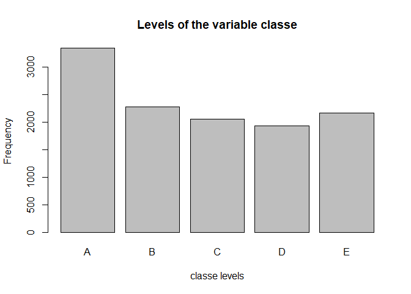
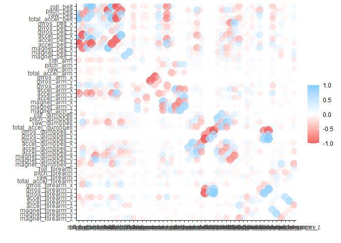
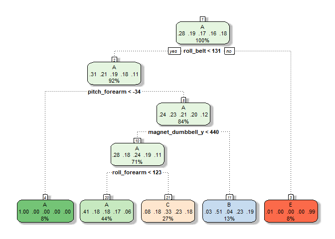
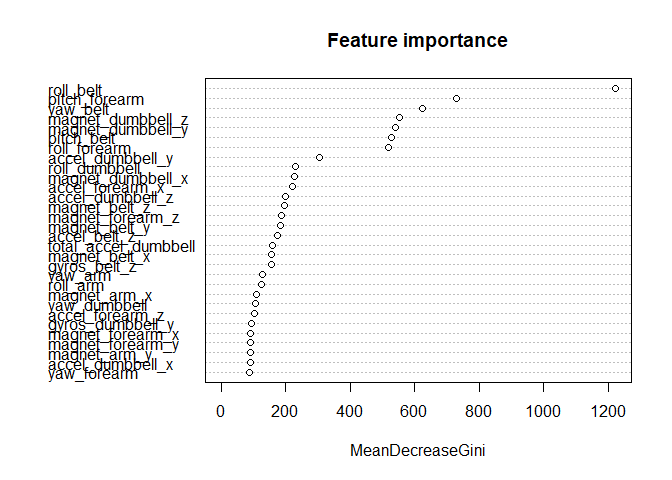

How well do you lift weights?
================

Wearable fitness trackers (e.g., Jawbone Up, Nike FuelBand, and Fitbit)
are very popular pieces of tech. They record the duration, distance, and
vigor of exercise through the use of accelerometers and other position
sensors. Many users use these data to quantify how much of a particular
activity they do, but they rarely quantify how well they do it.

The goal of this project was to predict the manner in which test
subjects lifted the barbell. The “manner” of the lift is a factor
variable within the “classe” variable in the training set. The dataset
consists of x, y, z acceleration, the rate of roll, pitch, and yaw are
included. In this study six participants were asked to perform barbell
lifts correctly and incorrectly in 5 different ways. Accelerometers were
attached to a belt worn by the participants, the forearm and arm of the
participants, and dumbbell that was lifted.

After data cleaning and some quick exploration, the manner/“classe” of
the lift three methods were compared: 1) decision tree, 2) random
forest, 3) gradient boosted model.

Random forest was found to have the best accuracy and leverage many of
the same features as the more simple decision tree. The random forest
model is used to predict the blind test dataset.

Below is the analysis:

1.  Load Libraries - prediction and visualization packages.

``` r
library(caret)
library(dplyr)
library(ggplot2)
library(corrr)
library(rattle)
library(randomForest)
```

1.  Load data

``` r
training <- read.csv("~/R_data/Coursera/PracticalMachineLearning/pml-training.csv")
testing <-  read.csv("~/R_data/Coursera/PracticalMachineLearning/pml-testing.csv")

#set the classe variable that we are predicting to a factor. It does not exist in the testing dataset,so we only need to do this to the training data.
training$classe <- as.factor(training$classe)
```

1.  Data cleaning - we are going to perform some near-zero variance
    cleaning and removing columns that are &gt;95% NA values. We will be
    doing these procedures on the training data, which will find the
    columns we need to remove, then removing those columns from the
    testing data. Remove some columns with near-zero variance

``` r
NZV_index <- nearZeroVar(training)
training <- training[,-NZV_index]
testing <- testing[,-NZV_index]

print(paste(length(NZV_index),"columns removed due to near-zero variance"))
```

    ## [1] "60 columns removed due to near-zero variance"

Remove columns that are &gt;95% NA

``` r
NA_index <- apply(training,2,function(x) sum(is.na(x)))>19000
training <- training[,NA_index==FALSE]
testing <- testing[,NA_index==FALSE]

print(paste(length(NA_index),"columns removed due to being mainly NA values (>95% NA's)"))
```

    ## [1] "100 columns removed due to being mainly NA values (>95% NA's)"

Remove some columns that are of no use to us in prediction (e.g., user
number)

``` r
training <- training %>%
  select(-X,-user_name,-raw_timestamp_part_1,-raw_timestamp_part_2,-cvtd_timestamp,-num_window)

testing <- testing %>%
  select(-X,-user_name,-raw_timestamp_part_1,-raw_timestamp_part_2,-cvtd_timestamp,-num_window)
```

1.  Splitting the training data into training and cross validation. The
    training data is quite large (currently 19622 rows). Because of this
    I decided to split the training data into training (tr\_tr) and
    cross validation datasets (tr\_cv) using a simple data partition on
    the “classe” variable. Because there are a lot of observations a
    simple partition will work fine. If there was less data, using a
    k-fold or leave-one-out method would be more applicable to conserve
    as many observations to train and test on.

``` r
inTrain <- createDataPartition(training$classe, p=0.6)[[1]]
tr_tr <- training[inTrain,]
tr_cv <- training[-inTrain,]
```

1.  Exploratory data analysis The first thing I did to explore the data
    was to check is whether the feature that we are predicting (classe =
    A:E) is balanced across our training dataset (tr\_tr). From a
    histogram/frequency plot, we can see that the classes of “classe”
    have equal observations. This means we are not going to over predict
    one class because we have more observations of it.

``` r
plot(tr_tr$classe, main="Levels of the variable classe", xlab="classe levels", ylab="Frequency")
```

<!-- -->

Next, I looked at the correlation of the different features. We can see
that there are some pretty strongly correlated features. Acceleration of
the belt in the y direction (accel\_belt\_y) is highly correlated with
the roll of the belt (roll\_belt). This makes sense as these two
measurements are very similar. Going forward, if we run into issues with
the model’s accuracy, or if we feel we are over tuning the model, we
could remove/combine some of the features.

``` r
tr_cor <- correlate(tr_tr[,1:52]) 
```

    ## 
    ## Correlation method: 'pearson'
    ## Missing treated using: 'pairwise.complete.obs'

``` r
tr_cor %>% shave()
```

    ## # A tibble: 52 x 53
    ##    term  roll_belt pitch_belt yaw_belt total_accel_belt gyros_belt_x
    ##    <chr>     <dbl>      <dbl>    <dbl>            <dbl>        <dbl>
    ##  1 roll~    NA        NA        NA               NA           NA    
    ##  2 pitc~    -0.215    NA        NA               NA           NA    
    ##  3 yaw_~     0.816    -0.699    NA               NA           NA    
    ##  4 tota~     0.981    -0.138     0.764           NA           NA    
    ##  5 gyro~    -0.123    -0.439     0.143           -0.171       NA    
    ##  6 gyro~     0.461    -0.398     0.528            0.405        0.333
    ##  7 gyro~    -0.464    -0.110    -0.278           -0.482        0.340
    ##  8 acce~     0.254    -0.966     0.706            0.169        0.479
    ##  9 acce~     0.927     0.0819    0.604            0.928       -0.273
    ## 10 acce~    -0.992     0.161    -0.778           -0.975        0.156
    ## # ... with 42 more rows, and 47 more variables: gyros_belt_y <dbl>,
    ## #   gyros_belt_z <dbl>, accel_belt_x <dbl>, accel_belt_y <dbl>,
    ## #   accel_belt_z <dbl>, magnet_belt_x <dbl>, magnet_belt_y <dbl>,
    ## #   magnet_belt_z <dbl>, roll_arm <dbl>, pitch_arm <dbl>, yaw_arm <dbl>,
    ## #   total_accel_arm <dbl>, gyros_arm_x <dbl>, gyros_arm_y <dbl>,
    ## #   gyros_arm_z <dbl>, accel_arm_x <dbl>, accel_arm_y <dbl>, accel_arm_z <dbl>,
    ## #   magnet_arm_x <dbl>, magnet_arm_y <dbl>, magnet_arm_z <dbl>,
    ## #   roll_dumbbell <dbl>, pitch_dumbbell <dbl>, yaw_dumbbell <dbl>,
    ## #   total_accel_dumbbell <dbl>, gyros_dumbbell_x <dbl>, gyros_dumbbell_y <dbl>,
    ## #   gyros_dumbbell_z <dbl>, accel_dumbbell_x <dbl>, accel_dumbbell_y <dbl>,
    ## #   accel_dumbbell_z <dbl>, magnet_dumbbell_x <dbl>, magnet_dumbbell_y <dbl>,
    ## #   magnet_dumbbell_z <dbl>, roll_forearm <dbl>, pitch_forearm <dbl>,
    ## #   yaw_forearm <dbl>, total_accel_forearm <dbl>, gyros_forearm_x <dbl>,
    ## #   gyros_forearm_y <dbl>, gyros_forearm_z <dbl>, accel_forearm_x <dbl>,
    ## #   accel_forearm_y <dbl>, accel_forearm_z <dbl>, magnet_forearm_x <dbl>,
    ## #   magnet_forearm_y <dbl>, magnet_forearm_z <dbl>

``` r
tr_cor %>% rplot()
```

    ## Don't know how to automatically pick scale for object of type noquote. Defaulting to continuous.

<!-- -->

1.  Decision tree modeling. The first model used here is a Decision
    Model (caret package) using default settings to start. From the
    confusion matrix the model does pretty poorly at classifying the
    “classe” variable.

``` r
modDT <- train(classe~.,data=tr_tr, method="rpart")
predDT <- predict(modDT, newdata=tr_cv)

cmDT <- confusionMatrix(predDT,tr_cv$classe)
cmDT$table
```

    ##           Reference
    ## Prediction    A    B    C    D    E
    ##          A 2045  629  643  572  206
    ##          B   30  516   46  222  201
    ##          C  152  373  679  492  385
    ##          D    0    0    0    0    0
    ##          E    5    0    0    0  650

Looking at the structure of the decision tree we can see that belt\_roll
is the strongest feature/root node.

``` r
fancyRpartPlot(modDT$finalModel,sub="")
```

<!-- -->

1.  Random forest modeling. The second approach used here is a Random
    Forest Model composed of 100 trees (caret package). From the
    confusion matrix it’s very apparent that this model is more accurate
    than the decision tree model.

``` r
modRF <- train(classe~.,data=tr_tr, method="rf", ntree=100)
predRF <- predict(modRF, newdata=tr_cv)

cmRF <- confusionMatrix(predRF,tr_cv$classe)
cmRF$table
```

    ##           Reference
    ## Prediction    A    B    C    D    E
    ##          A 2229   16    0    0    0
    ##          B    3 1502   11    0    1
    ##          C    0    0 1352   25    3
    ##          D    0    0    5 1258    3
    ##          E    0    0    0    3 1435

Diving into the random forest model, its interesting that the model is
using many of the same parameters as the decision tree model above, but
is much more accurate.

``` r
varImpPlot(modRF$finalModel, main ='Feature importance')
```

<!-- -->

1.  Gradient boosted model. The last approach used here is a Gradient
    boosted model (caret). The confusion matrix shows that there is not
    a large (if any) increase in the accuracy of the gradient boosted
    model over.

``` r
modGB <- train(classe~.,data=tr_tr, method="gbm", verbose=FALSE)
predGB <- predict(modGB, newdata=tr_cv)

cmGB <- confusionMatrix(predGB,tr_cv$classe)
cmGB$table
```

    ##           Reference
    ## Prediction    A    B    C    D    E
    ##          A 2184   41    0    2    0
    ##          B   30 1442   50    2   15
    ##          C   11   32 1299   49   11
    ##          D    4    1   17 1213   13
    ##          E    3    2    2   20 1403

1.  Compile the accuracy measures from the confusion matrices. From this
    we can see that the random forest model is the most accurate.

``` r
accTable <- rbind(cmDT$overall[1:4],cmRF$overall[1:4],cmGB$overall[1:4])
row.names(accTable) <- c("Decision Tree","Random Forest","Gradient Boots")
print(accTable)
```

    ##                 Accuracy     Kappa AccuracyLower AccuracyUpper
    ## Decision Tree  0.4957940 0.3408289     0.4846705     0.5069207
    ## Random Forest  0.9910783 0.9887123     0.9887412     0.9930386
    ## Gradient Boots 0.9611267 0.9508294     0.9566112     0.9652953

1.  Apply the random forest model to blind test dataset and predict the
    categories of “classe”.

``` r
predTestRF <- predict(modRF, newdata=testing)
print(predTestRF)
```

    ##  [1] B A B A A E D B A A B C B A E E A B B B
    ## Levels: A B C D E
